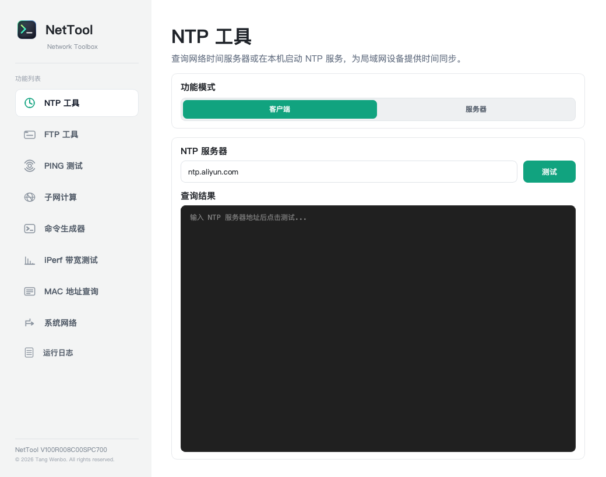
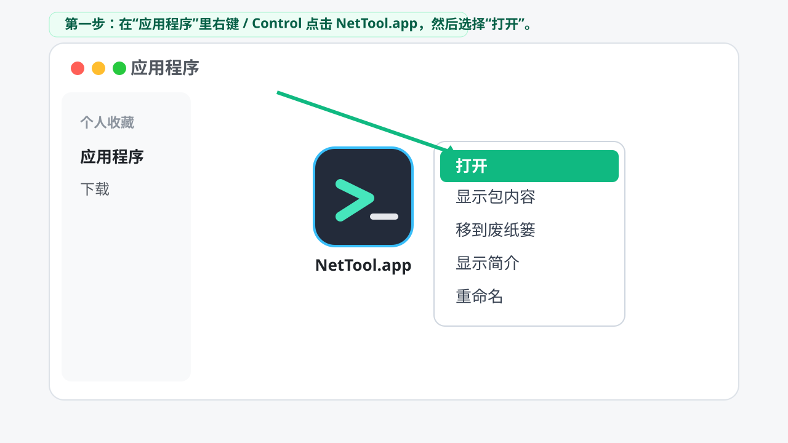
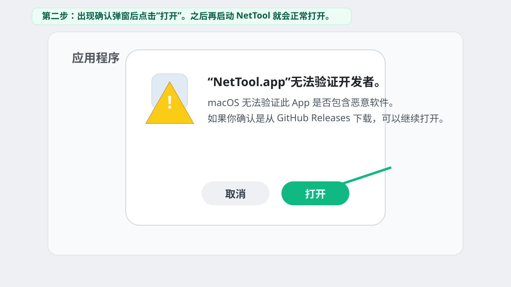

# NetTool

NetTool 是一个跨平台网络工具箱，基于 Python + PySide6 开发，当前版本为 `V100R009C00SPC500`。

## 功能

| 模块 | 说明 |
| --- | --- |
| NTP 工具 | NTP 客户端查询、本机 NTP 服务启动与日志记录 |
| FTP 工具 | FTP/SFTP 客户端、FTP 服务端、端口占用处理 |
| PING 测试 | ICMP Ping、Traceroute、TCPing |
| 子网计算 | 子网划分、CIDR 计算、路由聚合 |
| 命令生成器 | 基于内置或自定义模板批量生成网络配置命令 |
| 配置对比 | 普通文本配置文件左右对比、差异高亮和差异跳转 |
| iPerf 带宽测试 | 纯 Python TCP/UDP 带宽测试，支持客户端和服务器模式 |
| MAC 地址查询 | 基于本地 OUI 数据库查询厂商信息 |
| 系统网络 | 路由、hosts、网卡 IP 管理等系统网络配置工具 |
| 运行日志 | 汇总记录各模块运行、操作和错误日志 |



## macOS 首次打开

当前发布包未进行 Apple notarization 公证，macOS 首次打开时可能提示“Apple 无法验证 NetTool.app”。如果确认安装包来自本项目的 GitHub Releases，可以按下面方式打开：

1. 将 `NetTool.app` 拖入“应用程序”目录。
2. 在“应用程序”里右键或按住 `Control` 点击 `NetTool.app`，选择“打开”。
3. 在确认弹窗中再次点击“打开”。这个操作只需要首次启动时执行一次。





## 版本命名

项目使用 `VxxxRxxxCxxSPCxxx` 格式：

- `V`：主版本，代表架构或产品主线。
- `R`：发布版本，代表功能发布迭代。
- `C`：定制版本，默认 `C00`。
- `SPC`：补丁版本，代表修复和维护版本。

当前版本：`V100R009C00SPC500`。

## 本次更新

- 新增配置对比模块，支持 txt/cfg/conf/log 等文本配置左右逐行对比、差异高亮、空行补齐和文件拖入。
- PING 测试支持 Ping、Tracert、TCPing 最多 5 个目标并行检测，输出按目标分栏展示。
- PING/Tracert/TCPing 输出增加时间戳、IPv4 输入校验、独立统计信息和结果保存。
- PING 测试新增实时保存开关，可在运行时按目标实时写入 txt 文件。
- 系统网络模块优化管理员权限处理，Windows 下按需拉起提权 helper，减少重复确认。

## 开发运行

建议使用 Python 3.11+。

```bash
python3 -m pip install -r requirements.txt
python3 network_toolbox.py
```

macOS 下也可以直接运行开发版：

```bash
./run_macos_dev.command
```

## 目录结构

```text
network_toolbox.py       # 程序入口
core/                    # 主窗口、基础模块、图标、日志
modules/                 # 各功能模块
data/                    # 本地数据文件
templates/               # 命令生成器模板
docs/                    # 项目截图和文档资源
release/                 # 发布产物和离线构建目录
NetTool.spec             # macOS PyInstaller 打包配置
```

## 作者与协议

- 作者：Tang Wenbo (HCIE-Datacom)
- 版权：Copyright (C) 2026 Tang Wenbo
- 协议：GNU General Public License v3.0 or later
